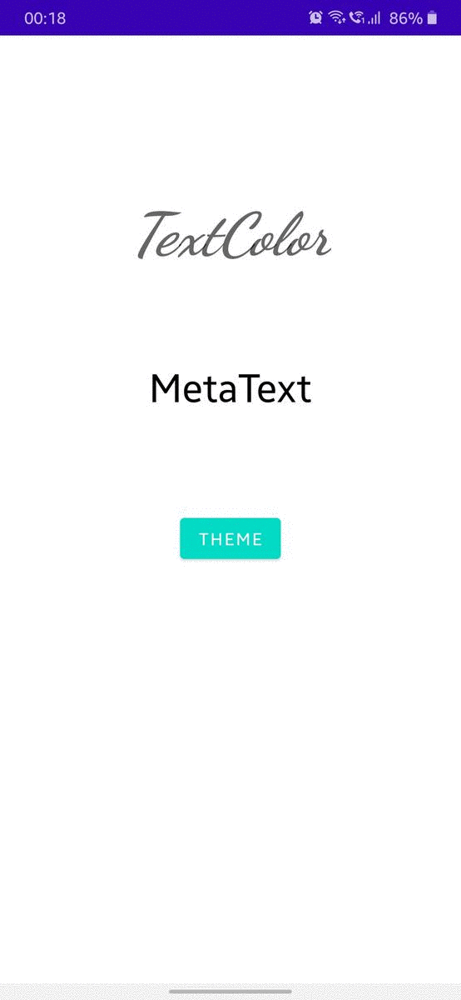

# Dark Theme Implementation using Material.io dialog android
This repository is to show and use implementaion of dark theme and [dialog box using material.io](https://material.io/develop/android/components/dialogs)
(snippet)
### Adding material.io sdk
Add the following line to your dependencies app gradle file.
```
implementation 'com.google.android.material:material:1.3.0-alpha02'
```

